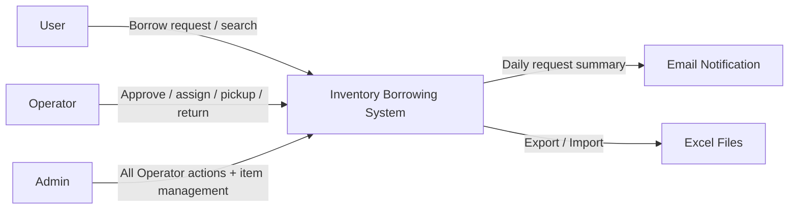

# Product summary

The **COMP Department Inventory Borrowing System** is a web-based system (PC + mobile) that manages departmental inventory (including computers and their components), supports **borrow request → approval → assignment → pickup → return**, and keeps **status, location, purchase, warranty, and audit logs** clear and searchable.

---

---

### System context

