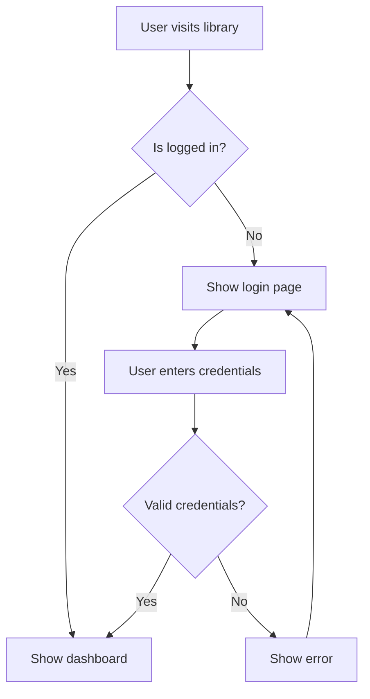
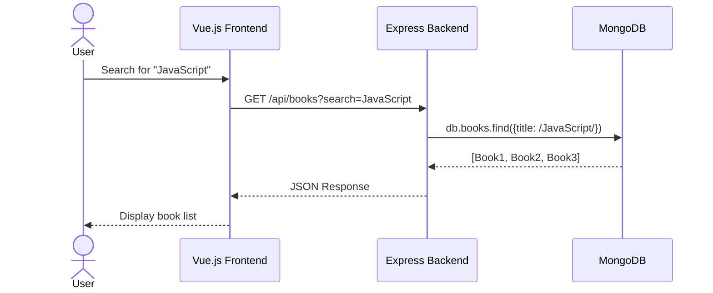

```mermaid
flowchart TD
    A[User visits library] --> B{Is logged in?}
    B -->|Yes| C[Show dashboard]
    B -->|No| D[Show login page]
    D --> E[User enters credentials]
    E --> F{Valid credentials?}
    F -->|Yes| C
    F -->|No| G[Show error]
    G --> D
```

2. Sequence Diagrams

Sequence diagrams show interactions between components over time. Perfect for API documentation.

```mermaid
sequenceDiagram
    actor User
    participant Frontend as Vue.js Frontend
    participant Backend as Express Backend
    participant DB as MongoDB

    User->>Frontend: Search for "JavaScript"
    Frontend->>Backend: GET /api/books?search=JavaScript
    Backend->>DB: db.books.find({title: /JavaScript/})
    DB-->>Backend: [Book1, Book2, Book3]
    Backend-->>Frontend: JSON Response
    Frontend-->>User: Display book list
```